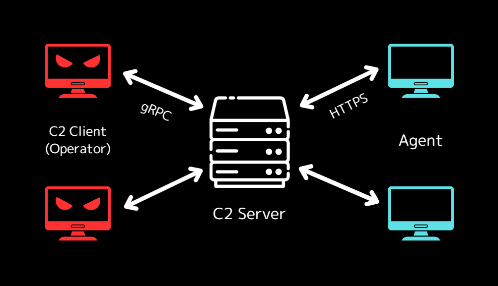

# Hermit C2

Command and Control Framework. 
I'm developing this for my learning purpose.



<br />

## Features

- The C2 server and C2 client.
- gRPC server/client for operations.
- TLS for secure communication between the C2 server, C2 client, and agents.
- HTTPS listener.
- SQLite for the data persistence.

<br />

## Warning

This project can be used for educational purpose only.  
It's prohibited to use it on systems which is not under your control.

<br />

## Requirements

It's assumed that you operate both the C2 server and C2 client on **Linux**.

- Linux
- Go 1.21+

<br />

## Installation

First, clone the repository and get into the project directory.

```sh
git clone github.com/hideckies/hermit.git
cd hermit
```

**C2 Server:**

```sh
make server
./hermit -h
```

**C2 Client:**

```sh
make client
./hermit-client -h
```

<br />

## Usage

### C2 Server

**1. Set the Configuration**

The `config.json` is in the project root. You can edit it for setting the bind address/port, domains, etc. Hermit automatically reads this configurations when starting the server. 

**2. Start the C2 server and console**

Simply execute the `hermit` command in the Hermit project root.  

```sh
hermit
# or
hermit server
```

You can also specify the config file path:

```sh
hermit -c /path/to/config.json
```

Now the C2 server and console start and you can do all operations for the Hermit C2.  

- As solo, you can use it as is in this server console.  
- As team, proceed below to run the C2 client for each operator.

**3. Transfer the Client Config File**

If you want to use Hermit as team and use C2 clients, please do the follow:  

1. Once the C2 server starts, the client config file is generated at `$HOME/.hermit/server/configs/client-config-<operator>.json`.  
2. Transfer this file to the C2 client computer. 
3. To generate a new config file for another operator, run the `client-config gen` command on the C2 server console.

### C2 Client

**1. Set the Configuration**

Before starting the C2 client, please follow the above **"Transfer the Client Config File"** section. 
You can edit the following config as needed:

- operator

**2. Start the C2 client**

You can start the C2 client anywhere, not just the project root.  

```sh
hermit-client -c /path/to/client-config.json
```
