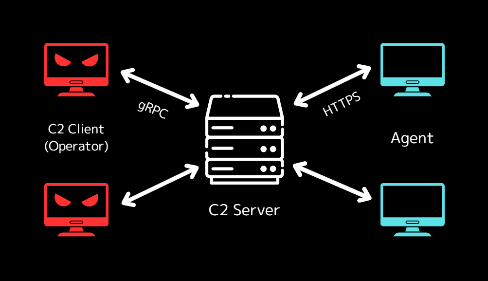

# Home

Hermit is a command and control framework written in Go.

## Features

- The C2 server and C2 client.
- gRPC server/client for operations.
- TLS for secure communication between the C2 server, client and agents.
- HTTPS listener.
- Multi staged payloads.
- SQLite for the data persistence.

## Warning

This project can be used for educational purpose only.  
It's prohibited to use it on systems which is not under your control.

## Requirements

It's assumed that you operate both the C2 server and C2 client on **Linux**.

- Linux
- Go 1.21+
